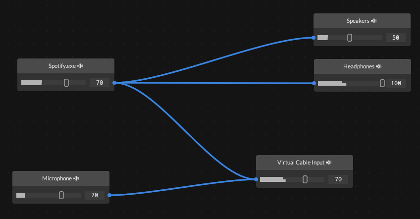

# Nodio



> **Note**
> This project is still very much a work in progress and experimental. Use with caution.

Nodio is a node-based audio routing application that allows you to route audio from applications and input
devices to multiple output devices.

At the moment Nodio only works on **Windows 10 (ver. 21H1 and later)** and **Windows 11**, but Mac and Linux support may come *later*™.

## Usage
```
cargo run -p nodio-app
```

## Features

* Route audio from an application to one or several output devices. On Windows this works by switching the application's
default audio endpoint to the first connected output device, and using software loopback recording for the rest.

* Route audio from an input device (e.g. a microphone) to one output device. On Windows this works by using Windows'
"Listen to this device" feature.

* The nodes and connections are automatically saved. If the application is restarted, the previous layout is loaded
and applied.